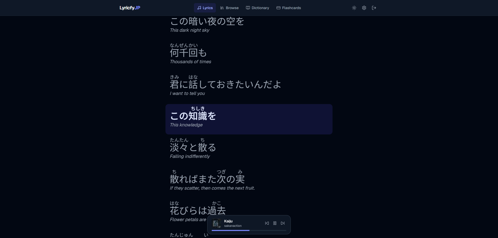
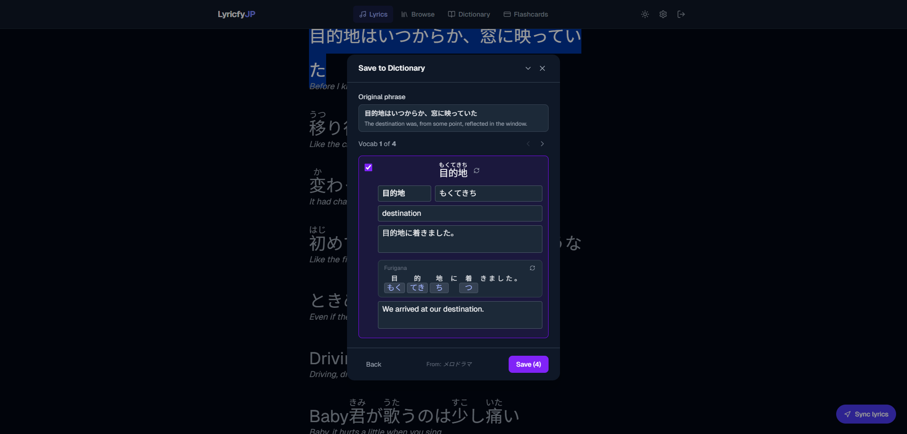
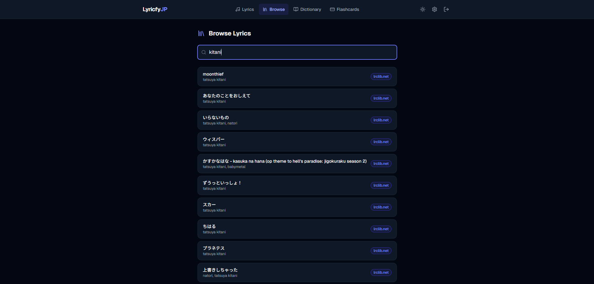
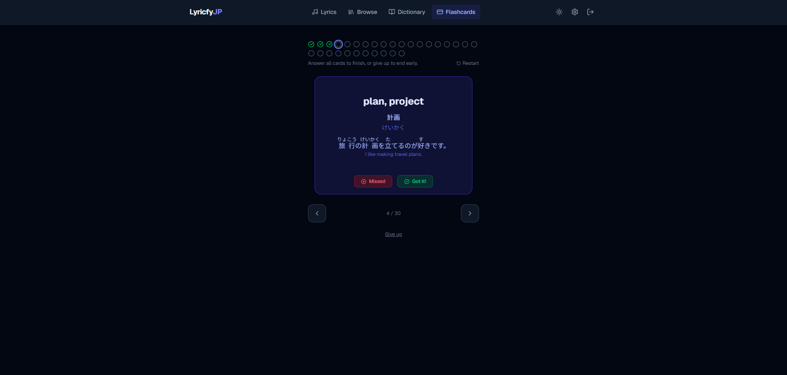
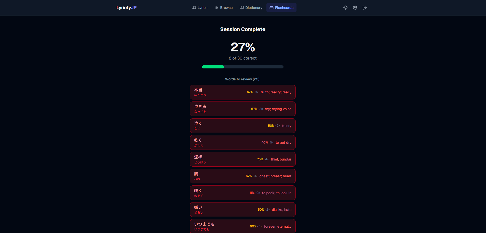
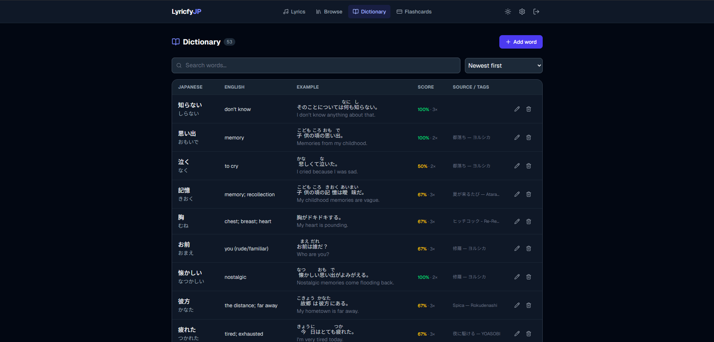

# Lyricfy JP

**Learn Japanese through music you actually love.**

Lyricfy JP connects to your Spotify account and shows you live, karaoke-style lyrics with furigana annotations and English translations. Save words to a personal dictionary and reinforce them with spaced-repetition flashcards — all in one place.

🌐 **[lyrical-jp.vercel.app](https://lyrical-jp.vercel.app)**

---



---

## Features

### Live Lyrics with Furigana
See the lyrics to whatever you're playing on Spotify, annotated with furigana (kana readings above kanji) and English translations line by line. On songs with timestamp data, lyrics scroll and highlight in sync with playback — click any line to jump to that moment in the song.



### Save Words to Your Dictionary
Highlight any phrase in the lyrics to open the **Save to Dictionary** panel. AI auto-fills the hiragana reading, English translation, and an example sentence. Choose to save a whole phrase or have the AI break it down into individual words so you can save exactly what you need.

### Browse Without Spotify
Search the full song library and read any set of lyrics without needing Spotify to be playing. Great for studying songs before you listen, or revisiting lyrics after a session.



### Flashcard Practice
Quiz yourself on the words in your dictionary. Choose Japanese → English or English → Japanese mode, pick a study set (newest 30, random 30, lowest-scoring 30, or a custom selection), and flip through 3D-animated cards.



After each session, the summary screen shows every word you missed along with its furigana reading so you can review them at a glance.



### Personal Dictionary
All your saved words live in the Dictionary. Search, sort by success rate or date, filter by tag, and track how well you know each word over time. Edit or delete any entry, or add words manually.



---

## Getting Started

### 1. Create an account
Sign up at [lyrical-jp.vercel.app](https://lyrical-jp.vercel.app) with email or Google.

### 2. Connect Spotify
Go to the Lyrics page and click **Connect Spotify**. You'll be taken through Spotify's OAuth flow. Once connected, play any Japanese song on Spotify and Lyricfy JP will pick it up automatically.

> **Note:** You need a Spotify account (free or premium). For playback controls (play/pause, seek, next/previous) you need Spotify Premium.

### 3. (Optional) Add an OpenRouter API key
Most popular songs are already in the shared cache — you can read lyrics and translations without any API key. For songs that haven't been translated yet, head to **Settings** and add your own [OpenRouter](https://openrouter.ai) API key. The key is encrypted with AES-256-GCM and never exposed to the client.

---

## Tech Stack

| | |
|---|---|
| Framework | Next.js 15 (App Router, TypeScript) |
| Styling | Tailwind CSS v4 |
| Database & Auth | Supabase (Postgres + RLS) |
| AI | OpenRouter → `google/gemini-2.0-flash-001` |
| Lyrics sources | lrclib.net (primary) · Genius scraping (fallback) · manual paste |
| Music | Spotify Web API |
| Deployment | Vercel |

---

## Self-Hosting

### Prerequisites
- Node.js 18+
- A Supabase project
- A Spotify app (register at [developer.spotify.com](https://developer.spotify.com))

### Environment variables

```env
NEXT_PUBLIC_SUPABASE_URL=
NEXT_PUBLIC_SUPABASE_ANON_KEY=
NEXT_PUBLIC_APP_URL=          # e.g. http://localhost:3000
SPOTIFY_CLIENT_ID=
SPOTIFY_CLIENT_SECRET=
ENCRYPTION_SECRET=            # 64 hex chars — generate with the command below
```

Generate `ENCRYPTION_SECRET`:
```bash
node -e "console.log(require('crypto').randomBytes(32).toString('hex'))"
```

### Setup

```bash
git clone https://github.com/wengti/lyricfy-jp.git
cd lyricfy-jp
npm install
```

Apply the database schema:
```bash
# Run the contents of supabase/schema.sql in your Supabase SQL editor
```

Set the Spotify redirect URI in your Spotify app dashboard:
```
{NEXT_PUBLIC_APP_URL}/api/spotify/callback
```

Start the dev server:
```bash
npm run dev
```

Open [http://localhost:3000](http://localhost:3000).

---

## License

MIT
